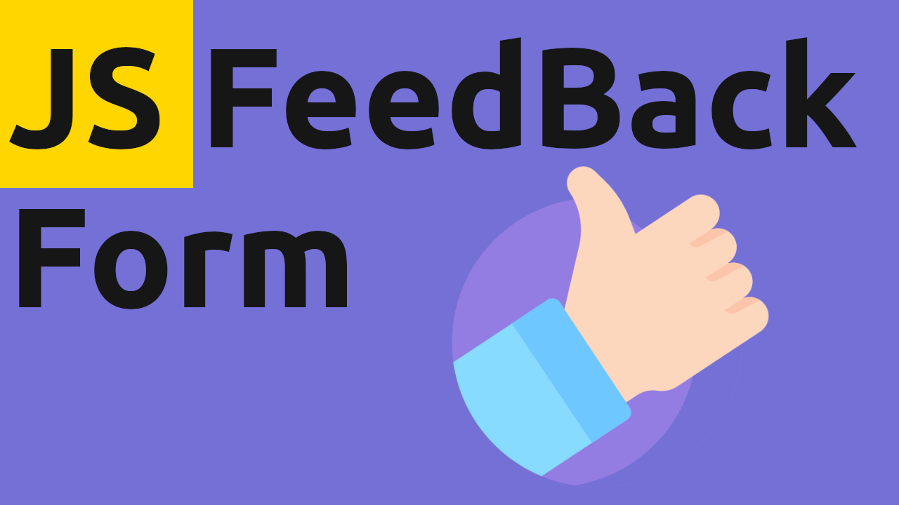

# 👠JS FeedBack Form App

<!-- ## Background -->

> Super Simple JavaScript FeedBack Form App!

### 📚 STACK
- Html
- Css
- Javascript

## Installation

Open index.html in your browser.

## 🐛 Bugs

...sure

### Video Guide Link
    
[Video Guide](https://youtu.be/L5tHfO1RgMk)

## License

Usage is provided under the MIT License. See [LICENSE](https://github.com/Yilber/readme-boilerplate/blob/master/LICENSE) for the full details.
